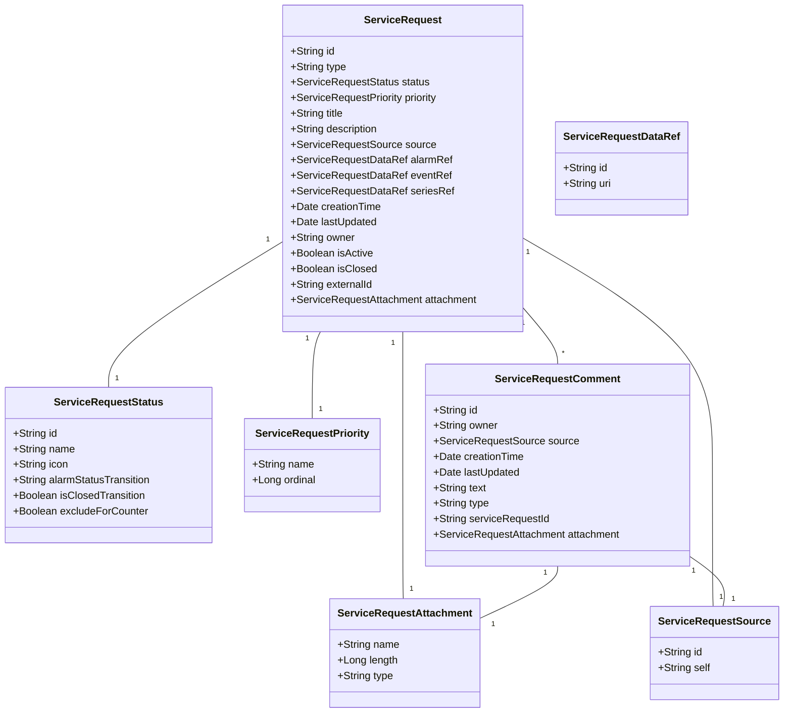

# cumulocity-microservice-service-request-mgmt

This microservice provides a domain specific API & Model for Field Service Managment (FSM) or Issue-Tracking-System (ITS).

Following class diagram shows the model which is implemented by this Microservice:



Detailed information you can finde, [Open API Specification](./docs/README.md)

The UI plugin [cumulocity-service-request-plugin](https://github.com/SoftwareAG/cumulocity-service-request-plugin) uses this REST API to manage and create service requests in Cumulocity.

The microservice also contains a [default service implementation](src/main/java/cumulocity/microservice/service/request/mgmt/service/c8y)

This default classes provide a basic FMS implementation in Cumulocity which is working without connecting to any external system. The internal created objects (Events) can be used to implement an asynchronous integration mechanism.

## FSM or ITS integration options 

### Proxy Object Implementation

All objects like Service Request, Comments, etc are stored at Cumulocity IoT. The synchronisation of this data to FSM/ITS data must be implemented in an additional adapter.

Pro:
- Aynchronouse, the API calls of FSM/ITS can be managed
- The processes are not blocked if connection problems to FSM/ITS occur

Cons:
- User doesn't get direct feedback if object is created at FSM/ITS.	

### Proxy API Implementation

Call direcly (forwareding) other API of FSM or ITS system without storing or creating objects at Cumulocity.

Pro:
-


Con:
-

Features:

- Declarative configuration of status list. This allows you to introduce your own status list and behavior with additional informations like alarm status transition, close transition, icon etc..
- Service requests are stored as event
- Specific Retention rule can be configured for EVENT with fragment type sr_Closed and Type c8y_ServiceReqeust
- Event attachment features is used for Service Request attachments
- Service request comments also stored as separate events
- Service request counter at device managed object
- Bidirectional reference between alarm and service request

If a synchronous (direct) integration to a system FSM/ITS is needed following service interfaces must be implemented:

[Service Interfaces](src/main/java/cumulocity/microservice/service/request/mgmt/service)

## Prerequisites

- Java installed >= 11
- Maven installed >= 3.6
- Cumulocity IoT Tenant >= 1010.0.0
- Cumulocity IoT User Credentials (Base64 encoded)


## Run

Cloning this repository into you local GIT repository

```console
git clone ...
```

Install archetype localy in your local maven repository

```console
mvn install
```


## Authors 

[Alexander Pester](mailto:alexander.pester@softwareag.com)

## Disclaimer

These tools are provided as-is and without warranty or support. They do not constitute part of the Software AG product suite. Users are free to use, fork and modify them, subject to the license agreement. While Software AG welcomes contributions, we cannot guarantee to include every contribution in the master project.

## Contact

For more information you can Ask a Question in the [TECHcommunity Forums](http://tech.forums.softwareag.com/techjforum/forums/list.page?product=cumulocity).

You can find additional information in the [Software AG TECHcommunity](https://tech.forums.softwareag.com/tag/Cumulocity-IoT).

_________________
Contact us at [TECHcommunity](mailto:technologycommunity@softwareag.com?subject=Github/SoftwareAG) if you have any questions.
