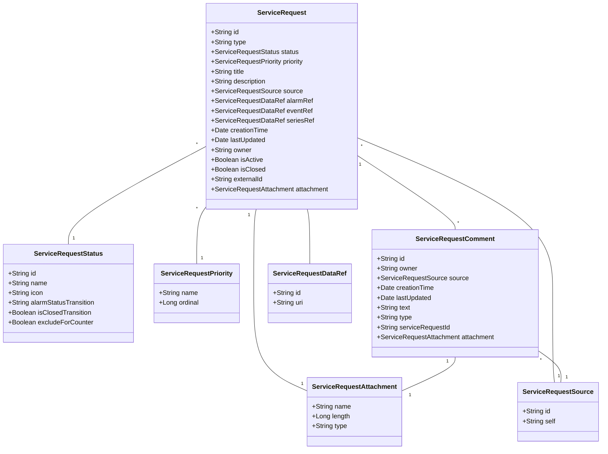

# cumulocity-microservice-service-request-mgmt

This microservice provides a domain specific API & Model for Field Service Managment (FSM) or Issue-Tracking-System (ITS).

Following class diagram shows the data model which is implemented by this Microservice. These classes and the identifiers are inspired by FSM but can also be used for an ITS, in that case handle ServiceRequest as "Ticket".



Detailed information about the REST API you can find, [Open API Specification](./docs/README.md)

The UI plugin [cumulocity-service-request-plugin](https://github.com/SoftwareAG/cumulocity-service-request-plugin) uses this REST API to perform typical CRUD operations.

The microservice also contains a [default service implementation](src/main/java/cumulocity/microservice/service/request/mgmt/service/c8y)

This default classes provide a basic FMS implementation in Cumulocity which is working without connecting to any external system. The internal created objects (Events) can be used to implement an asynchronous integration mechanism, see next integration option 1.

## FSM or ITS integration options 

### Option 1, Proxy Object Implementation (asynchronous)

As mentioned above, all objects like Service Request, Comments, etc are stored and managed at Cumulocity IoT. Synchronisation of this data to FSM/ITS data must be implemented in an additional component. This can be done in a frequent running job (polling) or event based using Cumulocity notification API. All IoT data which is needed for FSM/ITS systems are requested by Cumulocity standard API. Which IoT Data is need is highly dependent on the use-case and must be implemented in the Adapter. If the FSM/ITS provides also an event base mechanism, this should be used for updating Service-Request status etc..


Pro:
- Asynchronous and decoupled, the API calls of FSM/ITS can configured and better managed, like polling rates etc.
- Service Request management functions are already implemented see features list below
- The processes are not blocked if connection problems to FSM/ITS occur
- Feature can also be used without FSM/ITS integration 

Cons:
- User doesn't get direct feedback if object is created at FSM/ITS. (decoupled)
- Unnecessary calls if polling is used, particular if not much service requests get created
- Boundaries by using user context

Features of standard implementation:

- Declarative configuration of status list. This allows you to introduce your own status list and behavior with additional informations like alarm status transition, close transition, icon etc..
- Service requests are stored as event
- Specific Retention rule can be configured for EVENT with fragment type sr_Closed and Type c8y_ServiceReqeust
- Event attachment features is used for Service Request attachments
- Service request comments also stored as separate events
- Service request counter at device managed object
- Bidirectional reference between alarm and service request


### Option 2, Proxy API Implementation (synchronous)

Call direct (forwarding) other API of FSM or ITS system without storing or creating objects at Cumulocity.


Pro:
- Direct an instant communication, UI gets direct feedback if FSM/ITS object couldn't be created.
- No delay between UI feedback and FSM/ITS object creation.
- No additional data stored at Cumulocity (no Inbound data transfer)

Con:
- Service Request / Ticket can only be created if FSM/ITS is available and reachable
- Additional implementation effort
- If FSM/ITS system response slow, the complete solution will be slow, highly dependent on connectivity

Following service interfaces must be implemented:

[Service Interfaces](src/main/java/cumulocity/microservice/service/request/mgmt/service)

## Prerequisites

- Java installed >= 11
- Maven installed >= 3.6
- Cumulocity IoT Tenant >= 1010.0.0
- Cumulocity IoT User Credentials (Base64 encoded)


## Run

Cloning this repository into you local GIT repository

```console
git clone ...
```

Install archetype localy in your local maven repository

```console
mvn install
```


## Authors 

[Alexander Pester](mailto:alexander.pester@softwareag.com)

## Disclaimer

These tools are provided as-is and without warranty or support. They do not constitute part of the Software AG product suite. Users are free to use, fork and modify them, subject to the license agreement. While Software AG welcomes contributions, we cannot guarantee to include every contribution in the master project.

## Contact

For more information you can Ask a Question in the [TECHcommunity Forums](http://tech.forums.softwareag.com/techjforum/forums/list.page?product=cumulocity).

You can find additional information in the [Software AG TECHcommunity](https://tech.forums.softwareag.com/tag/Cumulocity-IoT).

_________________
Contact us at [TECHcommunity](mailto:technologycommunity@softwareag.com?subject=Github/SoftwareAG) if you have any questions.
