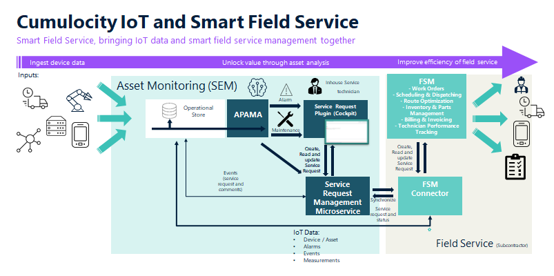

# What is this microservice about and why do we need it?

Smart Field Services need Field Service Management (FSM) Systems and/or Issue Tracking Systems (ITS). These systems are the integral part of performing and provide Smart Field Services. The next step of evolution is to combine FSM and IoT data, in order to increase the efficiency of field services and provide a even better customer experience.



This microservice and the UI plugin [cumulocity-service-request-plugin](https://github.com/SoftwareAG/cumulocity-service-request-plugin) can be seen as adapter for FSM or ITS. The service request object is the glue or bridge between Cumulocity IoT and FSM system.

Which device IoT data is need for the smart field service use case differs a lot and must be implemented in the FSM connector. Some device IoT data will play an important part:

1. Current Device location (geo location and address) -> Important for FSM: service object, route planning etc.
2. Alarm data (current alarms) -> Important for FSM: service request, dispatching and scheduling based on severity and status etc.
3. Serialnumber, hardware informations -> Important for FSM: service request, what kind of equipment is needed, spare parts and failure/maintenance plan.
4. Firmware and Software Version -> Important for FSM: What firmware or software is currently running on the device, legacy devices have often not the option to be updated remotely. If a service activity is planned additional actions can be combined like onsite software/firmware update.
5. Measurement and event data -> Important for FSM: Last measurements and events give the service technician last status of device before service request was created (Device satus Snapshot). To get more detailed information before the service activity is starting.

# API and Domain Model

This microservice provides a domain specific API & Model for service request.

Following class diagram shows the data model which is implemented by this Microservice. These classes and the identifiers are inspired by FSM but can also be used for an ITS, in that case handle ServiceRequest as Issue or Ticket.


Detailed information about the REST API you can find:

[Open API Specification as mark down](./docs/README.md)

[Open API Specification](./docs/openapi.json)


The UI plugin [cumulocity-service-request-plugin](https://github.com/SoftwareAG/cumulocity-service-request-plugin) uses this REST API to perform typical CRUD operations and makes this feature available for the cockpit application.

The microservice also contains a [default service implementation](src/main/java/cumulocity/microservice/service/request/mgmt/service/c8y)

This default classes provide a basic FSM implementation in Cumulocity which is working without connecting to any external system. The internal created objects (Events) can be used to implement an asynchronous integration mechanism, see integration option 1.

## Cumulocity CLI extension

If you want to use the [Cumulocity CLI](https://goc8ycli.netlify.app) to create and manage service requests, you can use the following extension:

[c8y-service-request-cliext](./go-c8y-cli/c8y-service-request-cliext/)

Example commands

Show configured status list in a formatted table
```console
c8y service-request-cliext status list
```

Configure a defined status list for your tenant
```console
c8y service-request-cliext status create --template service-request-cliext::ecStatusList.jsonnet
```

Create service requests based on active alarms
```console
c8y alarms list --status ACTIVE --device iPhone` Alex | c8y service-request-cliext sr createAlarm --description "Test"
```

Create service request based on an event of type note
```console
c8y events list --type c8y_SomeEventType --device iPhone` Alex | c8y service-request-cliext sr createNote --description "Test"
```

# Priority & Status Configuration

Priorities and status can be configured and managed during runtime. There isn't a predefined priority or status set implemented. This flexible design decision helps to integrated with any FSM/ITS. Even this systems have a configurable priority and status set. It is also possible to implement an automatic synchronization of status and priority list between both systems.

Use following API to configure:
[Priorities](./docs/Apis/ServiceRequestPriorityControllerApi.md) are rather simple and reflect the priority set which exist in the system.

Example:

```
[
    {
        "name": "high",
        "ordinal": 3
    },
    {
        "name": "medium",
        "ordinal": 2
    },
    {
        "name": "low",
        "ordinal": 1
    }
]
```

[Status](./docs/Apis/ServiceRequestStatusControllerApi.md) definition are a bit more complex and can have specific configuration for alarm status transition.

Example:

```
[
    {
        "id": "0",
        "name": "Created",
        "alarmStatusTransition": "ACKNOWLEDGED"
    },
    {
        "id": "1",
        "name": "Released"
    },
    {
        "id": "2",
        "name": "InProgress"
    },
    {
        "id": "3",
        "name": "IsWorkDone",
        "alarmStatusTransition": "CLEARED",
        "isExcludeForCounter": true
    },
    {
        "id": "4",
        "name": "Rejected",
        "isClosedTransition": true
    },
    {
        "id": "5",
        "name": "Closed",
        "alarmStatusTransition": "CLEARED",
        "isClosedTransition": true,
        "isDeactivateTransition": true
    },
    {
        "id": "7",
        "name": "Scheduled"
    },
    {
        "id": "8",
        "name": "ReadyForScheduling"
    }
]
```

The property `alarmStatusTransition` defines the alarm status which will be set if this service request changes to this status.

The property `isClosedTransition` defines the service request as closed in general and set the `sr_Closed` fragment. This fragment should be used to configure retention rules for `c8y_ServiceRequest` and `c8y_ServiceRequestComment`. 

The property `isDeactivateTransition` defines the service request as deactivated and set the `sr_Active` to false. This means the service request will filtered and not shown any more.

The property `isExcludeForCounter` defines the service request status which shouldn't be counted. The counter is stored and maintained on the device managed object.

The property `isSynchronisationActive` defines if the service request gets synchronized with the FSM/ITS. If this is not set, the default behaviour is used. For `isClosedTransition` == true or `isDeactivateTransition` == true the property is false. This means synchronisation are not active.


# FSM or ITS integration options 

## Option 1, Proxy Object Implementation (asynchronous)

As mentioned above, all objects like Service Request, Comments, etc are stored and managed at Cumulocity IoT. Synchronisation of this data to FSM/ITS data must be implemented in an additional component. This can be done in a frequent running job (polling) or event based using Cumulocity notification API. All IoT data which is needed for FSM/ITS systems are requested by Cumulocity standard API. Which IoT Data is need is highly dependent on the use-case and must be implemented in the Adapter. If the FSM/ITS provides also an event base mechanism, this should be used for updating Service-Request status etc..


Pro:
- Asynchronous and decoupled, the API calls of FSM/ITS can configured and better managed, like polling rates etc.
- Service Request management functions are already implemented see features list below
- The processes are not blocked if connection problems to FSM/ITS occur
- Feature can also be used without FSM/ITS integration 

Cons:
- User doesn't get direct feedback if object is created at FSM/ITS. (decoupled)
- Unnecessary calls if polling is used, particular if not much service requests get created
- Boundaries by using user context

Features of standard implementation:

- Declarative configuration of status list. This allows you to introduce your own status list and behavior with additional informations like alarm status transition, close transition, icon etc..
- Service requests are stored as event
- Specific Retention rule can be configured for EVENT with fragment type sr_Closed and Type c8y_ServiceReqeust
- Event attachment features is used for Service Request attachments
- Service request comments also stored as separate events
- Service request counter at device managed object
- Bidirectional reference between alarm and service request


## Option 2, Proxy API Implementation (synchronous)

Call direct (forwarding) other API of FSM or ITS system without storing or creating objects at Cumulocity. The service implementation will contains the client for the external FSM/ITS and must also handle the connection details.


Pro:
- Direct an instant communication, UI gets direct feedback if FSM/ITS object couldn't be created.
- No delay between UI feedback and FSM/ITS object creation.
- No additional data stored at Cumulocity (no Inbound data transfer)

Con:
- Complete featuer can only be used if FSM/ITS is available and reachable
- Additional implementation effort
- If FSM/ITS system response slow, the complete solution will be slow, highly dependent on connectivity

Following service interfaces must be implemented:

[Service Interfaces](src/main/java/cumulocity/microservice/service/request/mgmt/service)


# Prerequisites

- Java installed >= 11
- Maven installed >= 3.6
- Cumulocity IoT Tenant >= 1010.0.0
- Cumulocity IoT User Credentials (Base64 encoded)


# Run

Cloning this repository into you local GIT repository

```console
git clone ...
```

Install archetype localy in your local maven repository

```console
mvn install
```

# Useful links 

📘 Explore the Knowledge Base   
Dive into a wealth of Cumulocity IoT tutorials and articles in our [Tech Community Knowledge Base](https://tech.forums.softwareag.com/tags/c/knowledge-base/6/cumulocity-iot).  

💡 Get Expert Answers    
Stuck or just curious? Ask the Cumulocity IoT experts directly on our [Forum](https://tech.forums.softwareag.com/tags/c/forum/1/Cumulocity-IoT).   

🚀 Try Cumulocity IoT    
See Cumulocity IoT in action with a [Free Trial](https://techcommunity.softwareag.com/en_en/downloads.html).   

✍️ Share Your Feedback    
Your input drives our innovation. If you find a bug, please create an issue in the repository. If you’d like to share your ideas or feedback, please post them [here](https://tech.forums.softwareag.com/c/feedback/2). 

More to discover
* [Advanced Cumulocity IoT Microservice Monitoring - Part 1](https://tech.forums.softwareag.com/t/advanced-cumulocity-iot-microservice-monitoring-part-1/274963)  
* [How to install a Microfrontend Plugin on a tenant and use it in an app?](https://tech.forums.softwareag.com/t/how-to-install-a-microfrontend-plugin-on-a-tenant-and-use-it-in-an-app/268981)  
* [Cumulocity IoT Web Development Tutorial - Part 1: Start your journey](https://tech.forums.softwareag.com/t/cumulocity-iot-web-development-tutorial-part-1-start-your-journey/259613) 
* [The power of micro frontends – How to dynamically extend Cumulocity IoT Frontends](https://tech.forums.softwareag.com/t/the-power-of-micro-frontends-how-to-dynamically-extend-cumulocity-iot-frontends/266665)
   
# Authors 

[Alexander Pester](mailto:alexander.pester@softwareag.com)

# Disclaimer

These tools are provided as-is and without warranty or support. They do not constitute part of the Software AG product suite. Users are free to use, fork and modify them, subject to the license agreement. While Software AG welcomes contributions, we cannot guarantee to include every contribution in the master project.

# Contact

Contact us at [TECHcommunity](mailto:technologycommunity@softwareag.com?subject=Github/SoftwareAG) if you have any questions.
