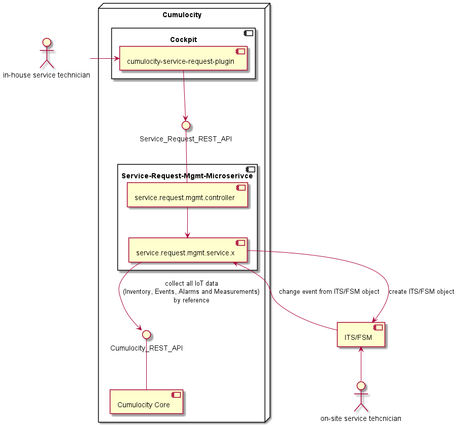

# What is this microservice about and why do we need it?

Smart Field Services require Field Service Management (FSM) Systems and/or Issue Tracking Systems (ITS). These systems are integral to performing and providing Smart Field Services. The next evolutionary step is to combine FSM and IoT data to increase field service efficiency and provide an even better customer experience.


This microservice and the UI plugin [cumulocity-service-request-plugin](https://github.com/Cumulocity-IoT/cumulocity-service-request-plugin) can be seen as adapters for FSM or ITS. The service request object serves as the glue or bridge between Cumulocity IoT and FSM systems.

The device IoT data needed for smart field service use cases varies significantly and must be implemented in the FSM connector. Some device IoT data plays an important role:

1. Current Device location (geo location and address) -> Important for FSM: service object, route planning etc.
2. Alarm data (current alarms) -> Important for FSM: service request, dispatching and scheduling based on severity and status etc.
3. Serial number, hardware information -> Important for FSM: service request, determining required equipment, spare parts and failure/maintenance plans.
4. Firmware and Software Version -> Important for FSM: What firmware or software is currently running on the device. Legacy devices often don't have the option to be updated remotely. If a service activity is planned, additional actions can be combined like onsite software/firmware updates.
5. Measurement and event data -> Important for FSM: Last measurements and events give the service technician the device's last status before the service request was created (Device Status Snapshot). This provides more detailed information before the service activity begins.

# API and Domain Model

This microservice provides a domain-specific API & Model for service requests.

The following class diagram shows the data model implemented by this Microservice. These classes and identifiers are inspired by FSM System but can also be perfectly used for an ITS, in that case, handle ServiceRequest as Issue or Ticket.


Detailed information about the REST API can be found here:

[Open API Specification as markdown](./docs/README.md)

[Open API Specification](./docs/openapi.json)


The UI plugin [cumulocity-service-request-plugin](https://github.com/Cumulocity-IoT/cumulocity-service-request-plugin) uses this REST API to perform typical CRUD operations and makes this feature available for the cockpit application.

The microservice also contains a [default service implementation](src/main/java/cumulocity/microservice/service/request/mgmt/service/c8y)

These default classes provide a basic FSM implementation in Cumulocity that works without connecting to any external system. The internally created objects (Events) can be used to implement an asynchronous integration mechanism—see integration option 1.

## Cumulocity CLI extension

If you want to use the [Cumulocity CLI](https://goc8ycli.netlify.app) to create and manage service requests, you can use the following extension:

[c8y-service-request-cliext](./go-c8y-cli/c8y-service-request-cliext/)

Example commands

Show the configured status list in a formatted table
```console
c8y service-request-cliext status list
```

Configure a defined status list for your tenant
```console
c8y service-request-cliext status create --template service-request-cliext::ecStatusList.jsonnet
```

Create service requests based on active alarms
```console
c8y alarms list --status ACTIVE --device iPhone` Alex | c8y service-request-cliext sr createAlarm --description "Test"
```

Create service request based on an event of type note
```console
c8y events list --type c8y_SomeEventType --device iPhone` Alex | c8y service-request-cliext sr createNote --description "Test"
```

# Priority & Status Configuration

Priorities and statuses can be configured and managed during runtime. There isn't a predefined priority or status set implemented. This flexible design decision helps integrate with any FSM/ITS. Even these systems have configurable priority and status sets. It's also possible to implement automatic synchronization of status and priority lists between both systems.

Use the following API to configure:
[Priorities](./docs/Apis/ServiceRequestPriorityControllerApi.md) are rather simple and reflect the priority set that exists in the system.

Example:

```
[
    {
        "name": "high",
        "ordinal": 3
    },
    {
        "name": "medium",
        "ordinal": 2
    },
    {
        "name": "low",
        "ordinal": 1
    }
]
```

[Status](./docs/Apis/ServiceRequestStatusControllerApi.md) definitions are a bit more complex and can have specific configuration for alarm status transitions.

Example:

```
[
    {
        "id": "0",
        "name": "Created",
        "alarmStatusTransition": "ACKNOWLEDGED"
    },
    {
        "id": "1",
        "name": "Released"
    },
    {
        "id": "2",
        "name": "InProgress"
    },
    {
        "id": "3",
        "name": "IsWorkDone",
        "alarmStatusTransition": "CLEARED",
        "isExcludeForCounter": true
    },
    {
        "id": "4",
        "name": "Rejected",
        "isClosedTransition": true
    },
    {
        "id": "5",
        "name": "Closed",
        "alarmStatusTransition": "CLEARED",
        "isClosedTransition": true,
        "isDeactivateTransition": true
    },
    {
        "id": "7",
        "name": "Scheduled"
    },
    {
        "id": "8",
        "name": "ReadyForScheduling"
    }
]
```

The property `alarmStatusTransition` defines the alarm status that will be set when this service request changes to this status.

The property `isClosedTransition` defines the service request as closed in general and sets the `sr_Closed` fragment. This fragment should be used to configure retention rules for `c8y_ServiceRequest` and `c8y_ServiceRequestComment`. 

The property `isDeactivateTransition` defines the service request as deactivated and sets `sr_Active` to false. This means the service request will be filtered and no longer shown.

The property `isExcludeForCounter` defines service request statuses that shouldn't be counted. The counter is stored and maintained on the device managed object.

The property `isSynchronisationActive` defines whether the service request gets synchronized with the FSM/ITS. If this is not set, the default behavior is used. For `isClosedTransition` == true or `isDeactivateTransition` == true, the property is false. This means synchronization is not active.


# FSM or ITS integration options 

## Option 1: Proxy Object Implementation (asynchronous)

As mentioned above, all objects like Service Request, Comments, etc., are stored as Events in Cumulocity IoT. Synchronization of this data to FSM/ITS data must be implemented in an additional component. This can be done with a frequently running job (polling) or event-based using the Cumulocity notification API. All IoT data needed for FSM/ITS systems is requested via the Cumulocity standard API. Which IoT data is needed is highly dependent on the use case and must be implemented in the Adapter. If the FSM/ITS also provides an event-based mechanism, this should be used for updating Service Request status, etc..


Pros:
- Asynchronous and decoupled; the API calls of FSM/ITS can be configured and better managed, like polling rates etc.
- Service Request management functions are already implemented—see features list below
- Processes are not blocked if connection problems to FSM/ITS occur
- Feature can also be used without FSM/ITS integration 

Cons:
- User doesn't get direct feedback if the object is created in FSM/ITS (decoupled)
- Unnecessary calls if polling is used, particularly when not many service requests are created
- Boundaries when using user context

Features of standard implementation:

- Declarative configuration of status list. This allows you to introduce your own status list and behavior with additional information like alarm status transition, close transition, icon, etc..
- Service requests are stored as events
- Specific retention rules can be configured for EVENTs with fragment type sr_Closed and Type c8y_ServiceRequest
- Event attachment features are used for Service Request attachments
- Service request comments are also stored as separate events
- Service request counter at device managed object
- Bidirectional reference between alarm and service request


## Option 2: Proxy API Implementation (synchronous)

Call directly (forwarding) other APIs of FSM or ITS systems without storing or creating objects in Cumulocity. The service implementation will contain the client for the external FSM/ITS and must also handle the connection details.



Pros:
- Direct and instant communication; UI gets direct feedback if FSM/ITS object couldn't be created
- No delay between UI feedback and FSM/ITS object creation
- No additional data stored in Cumulocity (no inbound data transfer)

Cons:
- Complete feature can only be used if FSM/ITS is available and reachable
- Additional implementation effort
- If FSM/ITS system responds slowly, the complete solution will be slow, highly dependent on connectivity

The following service interfaces must be implemented:

[Service Interfaces](src/main/java/cumulocity/microservice/service/request/mgmt/service)


# Prerequisites

- Java installed >= 11
- Maven installed >= 3.6
- Cumulocity IoT Tenant >= 1010.0.0
- Cumulocity IoT User Credentials (Base64 encoded)


# Run

Clone this repository into your local GIT repository

```console
git clone ...
```

Install archetype locally in your local maven repository

```console
mvn install
```

# Useful links 

📘 Explore the Knowledge Base   
Dive into a wealth of Cumulocity IoT tutorials and articles in our [Tech Community](https://techcommunity.cumulocity.com).  

💡 Get Expert Answers    
Stuck or just curious? Ask the Cumulocity IoT experts directly on our [Forum](https://techcommunity.cumulocity.com/c/forum/5).   

🚀 Try Cumulocity IoT    
See Cumulocity IoT in action with a [Free Trial](https://www.cumulocity.com/start-your-journey/free-trial).   

✍️ Share Your Feedback    
Your input drives our innovation. If you find a bug, please create an issue in the repository. If you'd like to share your ideas or feedback, please post them [here](https://techcommunity.cumulocity.com/c/feedback-ideas/14). 

   
# Authors 

[Alexander Pester](mailto:alexander.pester@cumulocity.com)

# Disclaimer

These tools are provided as-is and without warranty or support. They do not constitute part of the Cumulocity product suite. Users are free to use, fork and modify them, subject to the license agreement. While Cumulocity welcomes contributions, we cannot guarantee to include every contribution in the master project.
