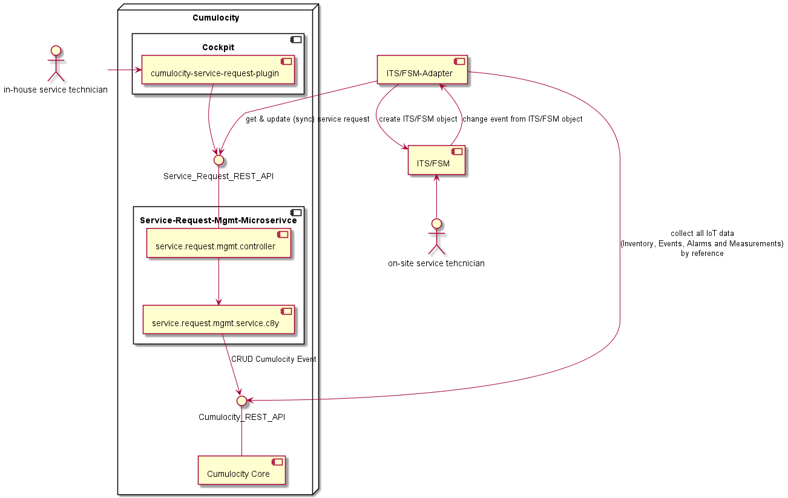

## cumulocity-microservice-service-request-mgmt

## Purpose

This microservice i one component which will extend Cumulocity for customers which have an additional service offering for the equipment (devices). This services can be heterogeneous like help desk support, maintenance support and/or availability contracts, production guarantee etc. Also onboarding (installation) and offboarding (deinstallation) of equipment on the field can be included. However, all this services usually need additional people (service technicians) and software tools like Issue-Tracking-System (ITS), Field Service Management (FSM).


The microservice provides an API and a domain model to handle and integrate ITS and FSM. The concrete integration to a system like Zendesk or ServiceNow is not part of this component, it only provides a suitable abstract API for it.

[Open API Specification](./docs/README.md)

The overall solution contains following components:

- Extended UI application
- Microservice (Service-Request-Mgmt)
- System X Adapter



## Prerequisites

- Java installed >= 11
- Maven installed >= 3.6
- Cumulocity IoT Tenant >= 1010.0.0
- Cumulocity IoT User Credentials (Base64 encoded)


## Run

Cloning this repository into you local GIT repository

```console
git clone ...
```

Install archetype localy in your local maven repository

```console
mvn install
```


## Authors 

[Alexander Pester](mailto:alexander.pester@softwareag.com)

## Disclaimer

These tools are provided as-is and without warranty or support. They do not constitute part of the Software AG product suite. Users are free to use, fork and modify them, subject to the license agreement. While Software AG welcomes contributions, we cannot guarantee to include every contribution in the master project.

## Contact

For more information you can Ask a Question in the [TECHcommunity Forums](http://tech.forums.softwareag.com/techjforum/forums/list.page?product=cumulocity).

You can find additional information in the [Software AG TECHcommunity](https://tech.forums.softwareag.com/tag/Cumulocity-IoT).

_________________
Contact us at [TECHcommunity](mailto:technologycommunity@softwareag.com?subject=Github/SoftwareAG) if you have any questions.
